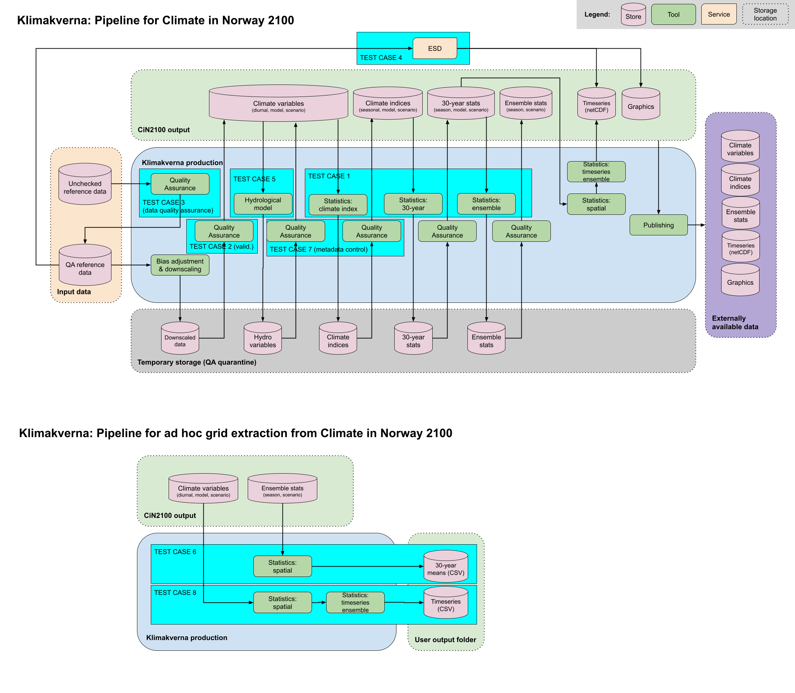

# KAPy Pilot at MET
This is a fork of KAPy developed at the Danish Meteorological Institute, for the purpose of producing climate adaptation information. [See KAPy documentation here](./docs/README.md)

We have chosen to make a fork, rather than using submodule, because we need to develop functionality that is not yet supported in base KAPy. This includes:
- Setting and validation of FAIR metadata
- Quality Assurance across the pipeline

Our full pipeline with intended test cases is seen below:


# Getting started

## Activate environment

Source conda on PPI store-C by 
```console
source /modules/centos7/conda/prod_04_2021/etc/profile.d/conda.sh
```

Activate environment for KAPy by go to `/lustre/storeC-ext/users/klimakverna/development/conda` and run 

```console
source activate KAPy
``` 

or run 

```console
conda activate /lustre/storeC-ext/users/klimakverna/development/conda/KAPy
```

from anywhere.

## Configuration

Configuration files in KAPy is located in the `.../klimakverna/development/KAPy/config` directory, where the different files are

| Config file name  | Configures                                                                                                                              |
| :---------------: | --------------------------------------------------------------------------------------------------------------------------------------- |
| `indicators.tsv`  | Which climate indicator to calculate                                                                                                    |
| `inputs.tsv`      | Which input files to use in calculation. Glob is used to search for file name matches                                                   | 
| `periods.tsv`     | Definition of periods in the calculation, start and end year, if time_binning for indicators is set to periods                          |
| `scenarios.tsv`   | Definition of which climate scenarios (rcp26, rcp45, rcp85, ssp370, ...) the inputs contain and the indicators should be calculated for |
| `seasons.tsv`     | Definition of seasons if season for indicators is set                                                                                   |
| `config.yaml`     | Which configuration files to use and where to look for output and configuration options for calculations                                |

For format and variable description see corresponding files in `.../klimakverna/development/KAPy/docs/configuration`.

Make sure that the `varName` in `inputs.tsv` matches the one defined in `indicators` and that `path` covers all the wanted input in a glob search, all the scenarios and years. A function to remove input files outside the periods range defined in `periods.tsv` was added in testcase 1. In `config.yaml` the output directories are set, this is where snakemake checks whether the output files exist or not, and decides which rules to run (if snakemake checks for changes in the files in addition to existence is uncertain).

Which configuration files to use in the calculation are set in `config.yaml` and which configuration to use is set in line 20 in the Snakefile, `.../klimakverna/development/KAPy/workflow/Snakefile`. 

## Run calculation

To check that configuration is valid and how many output files that will be generated, a dry run in snakemake is run by 

```console
snakemake -n
```

in the terminal. If everything is ok, the calculation is started by

```console
snakemake --cores 1
```

in the terminal for a small calculation or by submitting a job to the PPI queue for a larger job.

A job script is found in `.../klimakverna/development/KAPy/workflow/run_snakemake.sh`, change the email to your own. The output and error messages from the job will appear in `.../klimakverna/development/jobs`, where the `ERR_KAPy` files contain what snakemake prints during a job.

To submit a job, use

```console
qsub -V -b n -cwd /lustre/storeC-ext/users/klimakverna/development/KAPy/workflow/run_snakemke.sh
```

and to see status of the submitted job use

```console
qstat -q all.q -u <user name>
``` 

## Output

The output files from one calculation is saved in `.../klimakverna/development/KAPy/results`, where the different subdirectories correspond to the steps in the calculation. A subdirectory that notes the time binning was added to separate the different outputs when time binning is changed as snakemake doesn't recognize the difference. If a calculation was already done with time binning set to periods, and then time binning was changed to years, snakemake didn't recalculate the indicators. 

The steps in a calculation are

1. #### Variables
    `.../klimakverna/development/KAPy/results/1.variables`  
    [netcdf] x the total number of years in the period range  

    The primary variables (uncertain how different these files are compared to the input files except for the geographical cutout, maybe store as pickle in the future).

2. #### Indicators
    `.../klimakverna/development/KAPy/results/2.indicators`  
    [netcdf] x the total number of years in the period range  

    The calculated climate indicators.

3. #### Regridding
    `.../klimakverna/development/KAPy/results/3.commmon_grid`  

    Regridding step, not used yet, assumed all input files are on the same grid  

4. #### Ensemble statistics
    `.../klimakverna/development/KAPy/results/4.ensstats`  
    [netcdf] x 1   

    Ensemble statistics, calculation of statistics for each period. For instance average of one indicator over years in one period

5. #### Areal statistics
    `.../klimakverna/development/KAPy/results/5.areal_statistics`   
    [csv] x 1   

    Areal statistics, average over the whole geographical area and all the years in one period

6. #### Plots
    `.../klimakverna/development/KAPy/results/6.plots`  
    [png] x 1  

    Plots. One box plot when time binning is equal to periods, uses the csv file in the previous step directly

7. #### Netcdf
    `.../klimakverna/development/KAPy/results/7.netcdf`  
    [netcdf] x 1  

Calculated relative change from historical period to each of the other periods. Average over periods, not geographically

A new rule was added to the Snakefile in testcase 1, this rule saves datasets as netcdf and is called `save_change_to_netcdf`.
At the same time, the `plots_spatial` rule was deactivated as it used a lot of memory and produced error messages. `.../klimakverna/development/KAPy/workflow/KAPy/plot_change.py` was added to plot the spatial plot in stead, but it is not added as a rule, so it won't run automatically.

In addition, `.../klimakverna/development/KAPy/workflow/KAPy/calculate_model_ensemble_statistics_and_change.py` was added in testcase 1, but not as a rule and won't run automatically either. This function calculates ensemble statistics and change in a climate indicator over several models for one scenario, and therefore is a last step after indicator calculation for all models in one biasadjustment (CMIP5, CMIP6) and one scenario. The outputs are found in `.../klimakverna/development/output/testcase_1/model_ensembles`. 

# Git guidelines
- Create smaller manageable issues as you see fit.
- When working on an issue, create a branch and commit there.
- Always make a merge (pull) request when creating a branch.
- Always merge main into branch first before merging branch into main.
- Merge back into main branch regularly, ideally when completing an issue. If it takes longer, discuss with group
- Use pull requests for code review by assigning each other as reviewers.

# Folder structure
The main location of the repository is on PPI-ext, the user folder klimakverna is the base folder:
```
<base>/development/KAPy
```
We use the same conda environment, which we keep in a sister folder:
```
<base>/development/conda
```
In each test case, we regard Climate in Norway file locations as valid input. In this way, test cases should generally not depend on each other. Output is stored in appropriate subfolders here:
```
<base>/development/results
```